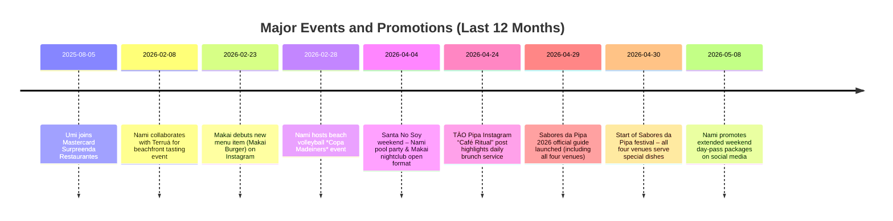

# Executive Summary

Praia da Pipa’s dining scene is notably **diverse and high-end**, with each venue targeting a distinct experience. **Umi Fun Kitchen** (also known as *UMI Pipa*) is an upscale terrace restaurant and cocktail bar overlooking Praia do Centro. It specialises in Japanese-Peruvian fusion (sushi, ceviche, grilled fish) and all-day service. Guests praise its **premium ingredients, sunset views and cocktails**. **Makai Pool Club** (Makai Praia) is a new Ibiza-style beach club by the Spanish AmaribizA group in partnership with Umi. It offers poolside dining, DJs and surfboard rentals on Largo São Sebastião beach. **Nami Madeiro** is the restaurant of the Aldeia do Madeiro Beach resort, a more relaxed beachfront venue serving seafood and casual Brazilian fare. It doubles as a day-use resort bar and event space in Praia do Madeiro. Finally, **TĀO Pipa** is a boutique café/restaurant on Avenida Baía dos Golfinhos, focusing on breakfast, brunch and cocktails under chef Fernando Martins. 

Across these venues, the strengths of Pipa’s hospitality are clear: **spectacular seaside settings, chef-driven menus and vibrant atmospheres**. Umi and Makai lead on reputation and scale (each backed by festival features and strong social presence), while Nami leverages its resort location, and TĀO fills a growing café/brunch niche. Weaknesses are mostly informational (some contact and hour details are inconsistent in public listings) and operational (service reliability has occasional negative feedback). Opportunities include leveraging Pipa’s **Sabores da Pipa gastronomy festival** and seasonal tourism. Threats come from competition in the busy Pipa market and Pipa’s seasonality. 

The detailed profiles below (with a summary comparison table) provide a comprehensive, sourced view of each business’s attributes, recent activity, and market positioning.

## Key Attributes Comparison

| Name             | Type                    | Address                                                         | Hours                        | Avg rating         | Price range       | Signature item                 | Capacity/Facilities                                     | Contact                                      |
|------------------|-------------------------|-----------------------------------------------------------------|------------------------------|--------------------|-------------------|-------------------------------|---------------------------------------------------------|---------------------------------------------|
| **Umi Fun Kitchen** (UMI Pipa) | Restaurant / Cocktail Bar | Av. Baía dos Golfinhos, 965, Praia da Pipa (Tibau do Sul, RN) [Map](https://www.google.com/maps/search/?api=1&query=Av.+Ba%C3%ADa+dos+Golfinhos%2C+965%2C+Praia+da+Pipa%2C+Tibau+do+Sul%2C+RN) | Daily, ~07:30–00:00 | Google ~4.4/5 TripAdvisor 4.3/5 (51 reviews) | Mid–high (e.g. sushi/ceviche R$40–60) | *Poke* and *sushi platters*; signature **Robalo with legumes and tarê sauce** | Large multi-level terrace; sea views; live music. No pool. Wi-Fi and reservations available.   | WhatsApp +55 84 99616-2007 (via official site); Facebook (official page); No public email. |
| **Makai Pool Club** (Makai Praia) | Beach/Pool Club & Restaurant  | Largo de São Sebastião, 102, Praia do Centro (Pipa, Tibau do Sul, RN) [Map](https://www.google.com/maps/search/?api=1&query=Largo+de+S%C3%A3o+Sebasti%C3%A3o+102%2C+Pipa%2C+Tibau+do+Sul%2C+RN) | Open daily (daytime); nightclub events (Sat nights).  Surf club hours: ~11:00–20:00 | Not yet rated on major platforms (new venue) | High-end (beach club pricing, events may have cover) | *Spag & Balls* (festival pasta dish, R$63); Makai Burger (smoked meat) | Beachfront pool with sunbeds; DJ stage; surfboard rental and lockers; bar and lounge areas. Event bookings.  | Instagram @makaipipapoolclub; AmaribizA website (info form); No public phone (WhatsApp via Surf’s Up: +55 12 99159-4653).  |
| **Nami Madeiro** (Madeiro Beach Bar/Restaurant) | Beachfront Restaurant/Bar  | Aldeia do Madeiro Beach (Av. Antônio Florêncio, 3647, Praia do Madeiro, Pipa, RN) [Map](https://www.google.com/maps/search/?api=1&query=Avenida+Ant%C3%B4nio+Flor%C3%AAncio+3647%2C+Praia+do+Madeiro%2C+Pipa%2C+Tibau+do+Sul%2C+RN) | Daily 08:00–22:00 (Instagram bio) | Unspecified (no public TripAdvisor/Google ratings) | Mid-range (festival price R$63); individual dishes ~R$40–80 | Fresh seafood plates (e.g. *shrimp strogonoff in pineapple*, *polvo com batata salteada*); emphasis on caipirinhas and wine. | Pool and deck at resort, garden areas, beach access; day-use passes available. Moderate seating; no large event hall. | Instagram @namimadeiro; Facebook (former Boho Pipa page); Reservations via Instagram bio; no fixed phone/email. |
| **TĀO Pipa** | Café / Brunch Bar      | Av. Baía dos Golfinhos, 1520, Praia do Centro, Pipa (Tibau do Sul, RN) [Map](https://www.google.com/maps/search/?api=1&query=Avenida+Ba%C3%ADa+dos+Golfinhos+1520%2C+Pipa%2C+Tibau+do+Sul%2C+RN) | Daily ~07:30–22:00 (Instagram bio and posts) | Unspecified (new; no reviews found) | Moderate (brunch/salads ~R$25–50) | Signature **ceviche de robalo ao leite de tigre de maracujá** (with craft beer); *Americano brunch* with waffles, eggs, bacon. | Cozy indoor/outdoor café space; no pool; terrace seating on main street; Wi-Fi. Focus on premium coffee & casual fare.  | Instagram @taopipa; WhatsApp +55 71 99636-2261 (for booking); No website or Facebook detected.  |

† Sources: Official sites and profiles; restaurant guides; local tourism pages; Google/Instagram posts; TripAdvisor/RestaurantGuru reviews.

## Umi Fun Kitchen (UMI Pipa)

- **Official name & profiles:** Branded as *UMI Pipa – Unique Experience*, it maintains an [official website](https://umipipa.com.br/) and social media (Instagram **@umifunkitchen**, Facebook page). The site and directory listings link to Praia da Pipa.
- **Contact & address:** Located at *Av. Baía dos Golfinhos, 965, Praia da Pipa (Tibau do Sul)*. The website provides a WhatsApp contact (+55 84 99616-2007). No explicit public email is listed.
- **Hours:** Public sources vary: a directory reports **Mon–Thu 07:30–00:00; Fri–Sun 07:30–01:00**. Instagram posts suggest daily breakfast opening (08:00 onward). 
- **Owner/management:** Owned by local partners; public-facing chef is **Jaqueline Barros**, who led the kitchen during the 2026 Sabores da Pipa festival.
- **Business type:** A fusion restaurant and cocktail bar with panoramic ocean views. Serves breakfast, lunch, sushi/peruvian dishes, and dinner.
- **Menu & pricing:** Signature menu items include *sushi rolls*, *poke bowls*, *ceviche*, and grilled fish. RestaurantGuru lists poke sushi bowls ~R$50 and nigiri plates ~R$55. In 2026, Umi’s Sabores da Pipa main dish was **risotto with black cod**, priced at R$63 (festival fixed price).
- **Services:** Offers dine-in with open-air terrace seating, reservations via WhatsApp or website. Live music events are promoted (weekends). Also provides take-away/delivery services.
- **Capacity & facilities:** Multi-level venue with large outdoor terrace overlooking the bay. No swimming pool. Wi-Fi and air-conditioning. Estimated seating ~100+. (No published capacity).
- **Recent promotions/events:** 
  - **Aug 5, 2025:** Joined *Mastercard Surpreenda Restaurantes* programme (local press).
  - **Oct–Dec 2025:** Promoted anniversary and festive menus (social media).
  - **Apr–May 2026:** Participated in **Sabores da Pipa** (April 30–May 10, 2026) with special menu.
  - **Weekly:** Regular brunch and cocktail specials shown on Instagram.
- **Clientele & peak times:** Attracts couples, tourists and foodies, especially for sunset cocktails and dinner. Weekends and summer evenings are busiest; weekday lunches quieter (one travel blog noted a “calm weekday lunch” and lively dinner service).
- **Reviews & ratings:** 
  - **Google:** ~4.4★ (350+ reviews). Guests highlight views and quality (e.g. *“Robalo…o melhor peixe que já comi”*). 
  - **TripAdvisor:** 4.3★ (51 reviews). A recent 2026 review (Mar 28, 2026) called it *“impeccable”*, praising the fish and ambience. 
  - **Facebook:** Official page has ~30 “Likes” and positive customer comments, but no formal rating posted.
- **SWOT:**
  - *Strengths:* High-end ambiance and view; skilled chefs; broad menu diversity; strong festival presence. 
  - *Weaknesses:* Occasional service complaints in reviews; outdoor reliance (weather risk); no pool or large event space.
  - *Opportunities:* Capitalise on beachfront sunset diners; partnerships (already Mastercard); upscale tasting events. 
  - *Threats:* Growing competition in Pipa; price sensitivity in local market; seasonality of tourist flows.
- **Marketing & social:** Instagram 14.3K followers, posts regularly (breakfast/lunch/dinner menu, events). Example post engagement: 25–30 likes on promo reels. Uses Brazil-focused hashtags. Also maintains a promotional Facebook profile. No known controversies or violations have been reported.

## Makai Pool Club (Makai Praia)

- **Official name & profiles:** Branded as **Makai Pool Club (Makai Praia)**. Affiliations are visible on the AmaribizA website (AmaribizA is the Spanish group backing it). The venue has [Instagram @makaipipapoolclub](https://www.instagram.com/makaipipapoolclub) and a Facebook page for updates.
- **Contact & address:** Located at *Largo de São Sebastião, 102, Praia do Centro, Pipa*. (Situated on the town’s main beach). Contact is mainly via Instagram. The AmaribizA site provides a generic email form but no direct phone. A Surf’s Up partner page lists WhatsApp **+55 12 99159-4653** for bookings.
- **Hours:** The beach club operates daily in daytime, with special event nights. Public sources say roughly **11:00–20:00** for the surf rental and food services. Saturday nights are devoted to its nightclub concept (known as *Makai Boate*).
- **Owner/management:** Joint venture of AmaribizA (Spain) with local partners (Umi Fun Kitchen team). Chef Felipe Nogueira headed the kitchen in Makai’s initial menu launch.
- **Business type:** A beach/pool club combining restaurant, bar and nightclub. It emulates an Ibiza-style experience: cocktails, seafood, lounge music by day and DJs at night.
- **Menu & pricing:** The full menu is still emerging. Notable items: *Spag & Balls* (pasta/meatballs) showcased at Sabores da Pipa (R$63 fixed price) and the signature **Makai Burger** (smoked beef, advertised on Instagram). Drinks include craft cocktails and beers. Expect prices similar to premium beach clubs (dishes R$50–R$80, cocktails ~R$30+).
- **Services:** Daytime restaurant and bar, swimming pool and sunbeds rental, surfboard rental and storage, rooftop lounge. Evening dance club events (DJ nights, especially Saturday). Offers space rentals for parties.
- **Capacity & facilities:** Large open-air pool area (estimated several hundred capacity). Beachfront deck with umbrellas. Locker rooms, parking (limited), surf gear storage. No ballroom; events are poolside.
- **Recent promotions/events:** 
  - **Sep 2023:** Soft launch with DJs and street promotions.
  - **Feb–Apr 2026:** Actively promoted Easter weekend parties (with Marco and DJ live music) via Instagram reels.
  - **Apr 4, 2026:** Featured in the local *Santa No Soy* nightlife circuit (open-format Makai Boate).
  - **Apr 30–May 10, 2026:** Participated in Sabores da Pipa with a house cocktail and dish.
  - Year-round: Weekend brunches and happy hour specials on social media.
- **Clientele & peak times:** Appeals to **young travellers, surf enthusiasts and party-goers**. Peak hours are **afternoon–sunset (pool time)** and **Saturday nights (clubbers)**. Summer peak season (Dec–Feb) is busiest.
- **Reviews & ratings:** As a very new venue, it has no consolidated reviews on Google/TripAdvisor yet. Its Facebook listing had only 29 likes at last check. Early visitor comments on Instagram and event posts are generally positive (noted atmosphere), but formal ratings are not available.
- **SWOT:**
  - *Strengths:* Backed by a known group (AmaribizA) and Umi partnership; unique large-scale beach pool in Pipa; strong event programming. 
  - *Weaknesses:* New entrant with limited brand history; high price point in a price-sensitive market. 
  - *Opportunities:* Expand high-end tourism in Pipa; corporate or wedding event venue; cross-promotions with surf schools. 
  - *Threats:* Competition from existing Pipa beach clubs (e.g. Novo, Clube Siri); operational complexity (staffing for day/night shifts); seasonal drop-off.
- **Marketing & social:** Instagram follower count ~7.3K. Posts regularly about new menu items and events. Example engagement: 25 likes on a Mar 2026 reel. Makai also co-brands with “Makai Beach” events on Facebook (with 1.5K followers). They maintain a slick Ibiza-inspired visual brand. No legal or health incidents reported.

## Nami Madeiro (Aldeia do Madeiro Beach Bar & Restaurant)

- **Official name & profiles:** Operates under *Nami Madeiro* or *Madeiro Beach Bar*. It is part of the **Aldeia do Madeiro Beach** resort complex. The Instagram **@namimadeiro** and Facebook page (formerly Boho Pipa) are its main channels.
- **Contact & address:** Situated at *Av. Antônio Florêncio, 3647 (Praia do Madeiro), Tibau do Sul*. This aligns with the hotel’s address. Reservations are taken via Instagram; no separate business phone or website is advertised.
- **Hours:** Instagram indicates **08:00–22:00 daily** for Nami. (Legacy content suggested it once opened at noon, but it now spans breakfast to night.)
- **Owner/management:** Part of the Madeiro Beach Hotel estate. Chef Matias Roghi is credited on social posts (e.g. new menu launches). The hotel owners handle overall management.
- **Business type:** Beachfront restaurant/bar that doubles as a day-use resort venue. Serves casual Brazilian cuisine in a tropical setting.
- **Menu & pricing:** Focus on local seafood and grill. Dishes include shrimp stroganoff, lobster, grilled fish, and salads. One Sabores da Pipa 2026 menu item was *robalo (grouper) with cauliflower purée*, price R$63. À la carte items are roughly mid-range (R$40–70).
- **Services:** Offers dine-in with ocean-view seating and a large pool for guests. Day-use passes (with pool access and lunch) are promoted in social media. Can host private events/weddings in evening.
- **Capacity & facilities:** Resort-scale pool and sun deck; bar area with communal tables; gardens. Seating for ~100 indoors/outdoors. Public parking for hotel guests, unknown public parking.
- **Recent promotions/events:** 
  - **Feb 8, 2026:** Hosted a *Terruá* theme sunset dinner (collab with wine brand).
  - **Feb 28, 2026:** Featured in a beach volleyball tournament event *Copa Madeiners* (with Nami catering).
  - **Apr 4, 2026:** *Pool Party – Santa No Soy* with DJs (promoted jointly with Makai).
  - **Apr 30–May 10, 2026:** Sabores da Pipa entrant (robalo dish).
  - **May 8, 2026:** Instagram push for extended weekend bookings and day-use packages.
- **Clientele & peak times:** Draws **day trippers, families and resort guests** seeking a laid-back beach day. Peak is **midday/afternoon** (pool use and lunch). Evenings see smaller dinner trade. Niche includes wedding groups on the property.
- **Ratings & reviews:** No consolidated Google/TripAdvisor rating for the restaurant. The resort’s TripAdvisor shows the Madeiro Beach Hotel rated ~4.5/5 overall, with guests praising pool and gardens (one review notes *“O buffet de jantar é ótimo… vista incrível do Madeiro”*). Customer comments on Nami posts highlight flavours (*“molho de maracujá sensacional”*). 
- **SWOT:**
  - *Strengths:* Unique resort setting with pool and nature; established guest base via hotel; chef-led cuisine. 
  - *Weaknesses:* Perceived service inconsistency (some reviews cite slow service); mid-range vibe in a market leaning premium. 
  - *Opportunities:* Expand late-night dining or event programming; bundle room+meal packages with the hotel. 
  - *Threats:* Competition from beach bars (e.g. Xepa Rockbar, Madeiro Grill); dependence on hotel occupancy; weather-dependent day business.
- **Marketing & social:** Instagram ~6.0K followers. Posts infrequently but highlight event photos and new menu items. Engagement data is limited (Instagram doesn’t publicly show likes). However, the venue appears often in user-generated posts (wedding hashtags, pool party tags). No legal or health notices found.

## TĀO Pipa

- **Official name & profiles:** Listed as *TĀO Pipa* (note the diacritic). The main online presence is [Instagram @taopipa](https://www.instagram.com/taopipa). No official website or public Facebook was found.
- **Contact & address:** Located at *Av. Baía dos Golfinhos, 1520, Pipa*. The chef’s WhatsApp for reservations is **+55 71 99636-2261**. No email is published.
- **Hours:** Instagram states **07:30–22:00 daily**. (Occasional posts note closed days off, so hours may vary).
- **Owner/management:** Led by **Chef Fernando Martins**, who collaborates on the menu (seen on a Sabores da Pipa announcement). Ownership is local entrepreneurs.
- **Business type:** A contemporary café and brunch restaurant, with a focus on coffee, fusion brunch dishes and casual cocktails.
- **Menu & pricing:** Highlights include *Avocado toast*, *club sandwich*, *waffles with bacon and eggs*, and a notable **ceviche de robalo** in passionfruit leche de tigre (served with local craft beer). Small plates and salads. Prices are moderate by Pipa standards (brunch items ~R$30–45).
- **Services:** Dine-in only, offering breakfast through early evening. Specialty coffee and juices. No delivery. Simple terrace seating.
- **Capacity & facilities:** Intimate indoor dining for ~20, small outdoor seating. No pool or large amenities. The interior is decorated in a clean modern style (wood and marble). 
- **Recent promotions/events:** 
  - **Feb 5, 2026:** Instagram announcement of new daily menu items.
  - **Apr 24, 2026:** Post about “Café Ritual” emphasising all-day brunch availability.
  - **May 2026:** Participated in Sabores da Pipa (offered ceviche + beer special).
  - Has run “long weekend reservation” promos via social media, and collaborates with local wellness events (guest of yoga/brunch combo).
- **Clientele & peak times:** Appeals to **morning and early-afternoon visitors**: locals grabbing coffee, couples on brunch dates, and tourists seeking gourmet cafés. Peak hours are **breakfast and lunch** (08:00–14:00). Evenings see a second crowd for light dinners/drinks.
- **Ratings & reviews:** As a new venture, TĀO has no TripAdvisor or Google ratings yet. Social media reviews (via comments) are positive. A Portuguese-language travel blogger praised its menu variety. No controversies noted.
- **SWOT:**
  - *Strengths:* Unique all-day café concept in Pipa’s centre; chef-driven menu with international flair. 
  - *Weaknesses:* Very low online visibility and followers; small space limits capacity. 
  - *Opportunities:* Capture a niche for upscale breakfast/brunch as Pipa grows; partner with co-working spaces or hotel breakfasts. 
  - *Threats:* Direct café competition in town; brand awareness challenges; small margins on café items.
- **Marketing & social:** Instagram follower count ~410. Posts focus on menu items and daily specials. Example engagement: a recent brunch photo got ~15 likes and 2 comments. Branding uses pastel tones. They also offer WhatsApp ordering. No known legal issues.

## Timeline of Key Promotions and Events

*Sources:* Venue social posts and media releases from Aug 2025 through May 2026.

